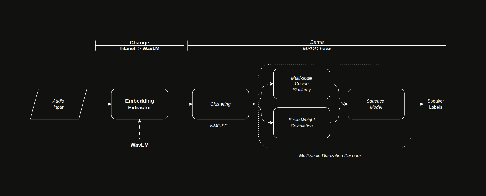

<div align="center">

# WavLMMSDD

This repository combines `WavLM`, a powerful speech representation model from *Microsoft*, with `MSDD` *(Multi-Scale
Diarization Decoder)*, a state-of-the-art approach for speaker diarization from *Nvidia*. By merging WavLM’s robust
feature extraction capabilities with MSDD’s advanced clustering and segmentation, this project enables accurate
identification of multiple speakers in audio streams—especially in challenging, noisy, or overlapping speech scenarios.

In particular, this setup uses the **Diarization MSDD Telephonic** model (`diar_msdd_telephonic` in NeMo), making it
well-suited for **telephony or call center** environments where speech overlap and background noise are common. Use this
repository as a starting point for projects that demand robust speaker diarization in environments where speech overlap
or varied audio conditions are critical factors.

**Note**: _If you would like to contribute to this repository,
please read the [CONTRIBUTING](.docs/documentation/CONTRIBUTING.md) first._


[](https://linkedin.com/in/bunyaminergen)

</div>

---

### Table of Contents

- [Architecture](#architecture)
- [Features](#features)
- [Reports](#reports)
- [Installation](#installation)
- [Usage](#usage)
- [File Structure](#file-structure)
- [Version Control System](#version-control-system)
- [Upcoming](#upcoming)
- [Documentations](#documentations)
- [License](#licence)
- [Links](#links)
- [Team](#team)
- [Contact](#contact)
- [Citation](#citation)

---

### Architecture



---

### Features

#### Key Capabilities

- [x] **WavLM-Based Embeddings**: *Leverages WavLM to generate high-quality speech representations, improving speaker
  identification.*
- [x] **Multi-Scale Diarization (MSDD)**: *Applies multi-scale inference for precise speaker segmentation, even with
  overlapping speech.*
- [x] **Scalable Pipeline**: *Modular design allows easy integration and customization for various diarization tasks or
  research experiments.*

#### Models

- [x] **WavLM-Base-Plus for Speaker Verification**
- [x] **WavLM-Base for Speaker Verification**
- [x] **Nvidia NeMo Diarization MSDD Telephonic**

---

### Reports

##### Benchmark

Below is an example benchmark comparing metrics for different models on a The Ami Corpus dataset.
These models use Multi-Scale Diarization Decoder (MSDD) with different embedding backbones: **TitaNet** and **WavLM**.

> **INFO**
> - Experiments were conducted on an NVIDIA GeForce RTX 3060 using CUDA 12.6 (Driver Version 560.35.03).
> - We randomly selected 10 samples from the AMI Corpus (`Array1-01.tar.gz`), each 60 seconds long.
> - **MSDD (Titanet)** and **MSDD (WavLMMSDD)** refer to using TitaNet vs. WavLM as the speaker-embedding model.
> - For a detailed Jupyter notebook demonstrating how this benchmark was performed, see:  
    > [**`notebook/benchmark.ipynb`**](notebook/benchmark.ipynb)

| Model                    | **DER** | **FA** | **MISS** | **CER**  | **Duration(sec)** |
|--------------------------|---------|--------|----------|----------|-------------------|
| **MSDD + TitaNet**       | 0.9963  | 0.0010 | 0.9946   | 0.0015   | 644               |
| **MSDD + WavLMBasePlus** | 0.9961  | 0.0010 | 0.9946   | 0.0016   | 18                |

- **DER**: *Diarization Error Rate*
- **FA**: *False Alarm Rate*
- **MISS**: *Missed Detection Rate*
- **CER**: *Confusion Error Rate*

---

### Installation

##### The Python Package Index (PyPI)

```Bash
pip insall wavlmmsdd
```

---

### Usage

```python
# Standard library imports
from typing import Annotated

# Local imports
from wavlmmsdd.audio.diarization.diarize import Diarizer
from wavlmmsdd.audio.feature.embedding import WavLMSV
from wavlmmsdd.audio.preprocess.resample import Resample
from wavlmmsdd.audio.preprocess.convert import Convert
from wavlmmsdd.audio.utils.utils import Build

def main() -> Annotated[None, "No return value"]:
    """
    Demonstrate the audio processing workflow from a WAV file
    to a diarization result.

    This function performs the following steps:
    1. Resamples the audio to 16 kHz.
    2. Converts the audio to mono.
    3. Builds a manifest file.
    4. Obtains embeddings.
    5. Runs diarization.

    Returns
    -------
    None

    Examples
    --------
    >>> main()
    No direct output is produced, but the specified audio file is
    processed and the results are saved or printed as logs.
    """
    
    # Audio Path
    audio_path = "audio.wav"

    # Resample to 16000 Khz
    resampler = Resample(audio_file=audio_path)
    wave_16k, sr_16k = resampler.to_16k()

    # Convert to Mono
    converter = Convert(waveform=wave_16k, sample_rate=sr_16k)
    converter.to_mono()
    saved_path = converter.save()

    # Build Manifest File
    builder = Build(saved_path)
    manifest_path = builder.manifest()

    # Embedding
    embedder = WavLMSV()

    # Diarization
    diarizer = Diarizer(embedding=embedder, manifest_path=manifest_path)
    diarizer.run()

if __name__ == "__main__":
    main()
```

---

### File Structure

```Text
.
├── .data
│   └── example
│       └── ae.wav
├── .docs
│   ├── documentation
│   │   ├── CONTRIBUTING.md
│   │   └── RESOURCES.md
│   └── img
│       └── architecture
│           ├── WavLMMSDDArchitecture.drawio
│           └── WavLMMSDDArchitecture.gif
├── environment.yaml
├── .github
│   ├── CODEOWNERS
│   └── workflows
│       └── pypi.yaml
├── .gitignore
├── LICENSE
├── MANIFEST.in
├── notebook
│   └── benchmark.ipynb
├── pyproject.toml
├── README.md
├── requirements.txt
└── src
    └── wavlmmsdd
        ├── audio
        │   ├── config
        │   │   ├── config.yaml
        │   │   ├── diar_infer_telephonic.yaml
        │   │   └── schema.py
        │   ├── diarization
        │   │   └── diarize.py
        │   ├── feature
        │   │   └── embedding.py
        │   ├── preprocess
        │   │   ├── convert.py
        │   │   └── resample.py
        │   └── utils
        │       └── utils.py
        └── main.py

18 directories, 24 files
```

---

### Version Control System

##### Releases

- [v0.1.0](https://github.com/bunyaminergen/WavLMMSDD/archive/refs/tags/v1.0.0.zip) _.zip_
- [v0.1.0](https://github.com/bunyaminergen/WavLMMSDD/archive/refs/tags/v1.0.0.tar.gz) _.tar.gz_

##### Branches

- [main](https://github.com/bunyaminergen/WavLMMSDD/main/)
- [develop](https://github.com/bunyaminergen/WavLMMSDD/develop/)

---

### Upcoming

- [ ] **WavLM Large:** Integrate the WavLM Large model.

---

### Documentations

- [RESOURCES](.docs/documentation/RESOURCES.md)
- [CONTRIBUTING](.docs/documentation/CONTRIBUTING.md)

---

### Licence

- [LICENSE](LICENSE)

---

### Links

- [Github](https://github.com/bunyaminergen/WavLMMSDD)
- [Website](https://bunyaminergen.com)
- [Linkedin](https://www.linkedin.com/in/bunyaminergen)

---

### Team

- [Bunyamin Ergen](https://www.linkedin.com/in/bunyaminergen)

---

### Contact

- [Mail](mailto:info@bunyaminergen.com)

---

### Citation

```bibtex
@software{       WavLMMSDD,
  author       = {Bunyamin Ergen},
  title        = {{WavLMMSDD}},
  year         = {2025},
  month        = {02},
  url          = {https://github.com/bunyaminergen/WavLMMSDD},
  version      = {v0.1.0},
}
```

---
